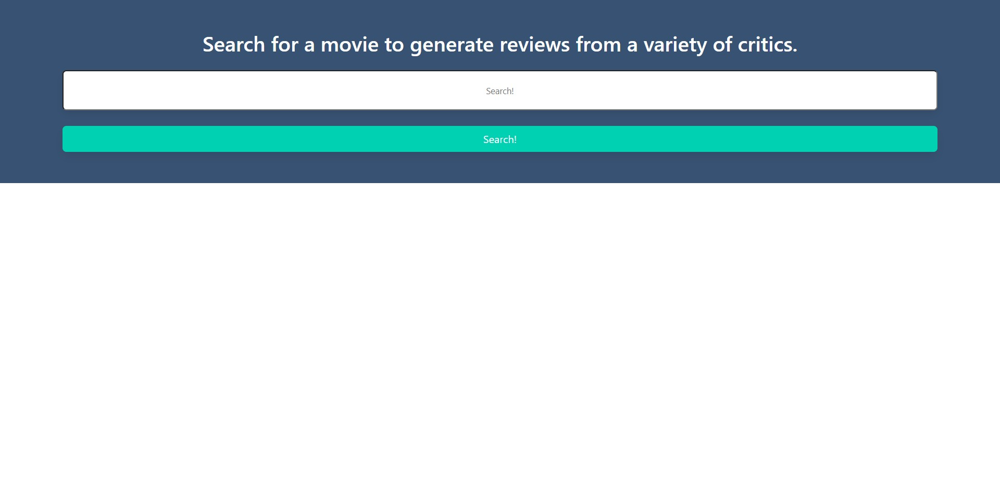

# Project 1: Movie Rating Comparison

Live Link: https://wtriii.github.io/Project-1-Shopping-Comparison-Site/ 
GitHub Repo Link: https://github.com/WTRIII/Project-1-Shopping-Comparison-Site 

Collaborators: Keshav Krishnan, Mackenzie Neveaux, Jesse Alvarez, William Renfroe
- GitHub Links:
    - Keshav: https://github.com/Xevshak
    - Mackenzie: https://github.com/mackenzieneveaux
    - Jesse: https://github.com/Jalvarez025
    - William: https://github.com/WTRIII

## Summary
    
    The purpose of our project is to create a site that allows a user to search for a movie and compare ratings of top critic sites in addition to following a link to the movie where more information can be found. By using APIs to aggregate data, we created a site that gets information from multiple sites and presents the information in a centralized location. From here, the user can compare different ratings of any movie to see differences in reviews, see a short plot summary, and follow a link to more information about the movie.

    The site uses 2 Server-side APIs to generate the information and Bulma as the CSS framework. The site uses Java Script to power the functionality.

## Image of completed site

## Image of completed site after used for a user search
 

### User Story

Conceive and execute a design that solves a real-world problem by integrating data received from multiple server-side API requests. 

The team identified the problem of biased review sites for movies. We set out to create a neutral site that aggregates multiple rating sources in one location for comparison of ratings by the user. The user can also access additional information regarding a searched movie. 

### Technical Requirements

All technical requirements were accomplished for this project. The technical requirements are as follows: 

- Use a CSS framework other than Bootstrap
- Be interactive (i.e., accept and respond to user input).
- Use at least two server-side APIs
- Does not use alerts, confirms, or prompts (uses modals instead)
- Use client-side storage to store persistent data
- Be responsive to different screen sizes
- Have a polished UI
- Have a clean repository that meets quality coding standards (file structure, naming conventions, follows best practices for class/id naming conventions, indentation, quality comments, etc.)
- Have a quality README (with unique name, description, technologies used, screenshot, and link to deployed application)
- Be deployed to GitHub Pages

### Future Development

    The site presents opportunities for future development in multiple ways:

    1. Searching for genres of movies using filters, rather than only movie titles
    2. Broader search functionality (more user-forgiving regarding search terms)
    3. Image carousels for a searched movie in order to see image stills and different posters for the same movie
    4. Creating a busier homepage, such as adding trending movies, popular movies or genres, trivia
    5. Implementation of advanced styling
    6. Monetization through adds or sponsorship

### Summary of Code
    1. API Functionality
        -Created a function that used the search term to create an API url using string concatenation, and would use the url to make a fetch request from the API
        -Edited user input to remove extra whitespace and format spaces as "%20" in order to allow the API to read it
        -Pulled the movie's ID value from the results array and passed it into a second function
        -Used the movie's ID to look up information about it including name, ratings from multiple sites, and the poster image
        -Used string concatenation to creazte the imdb url used in the "read more" link
        -Added catches for error states possible in the code, including having no search results or running out of daily pulls from the API
